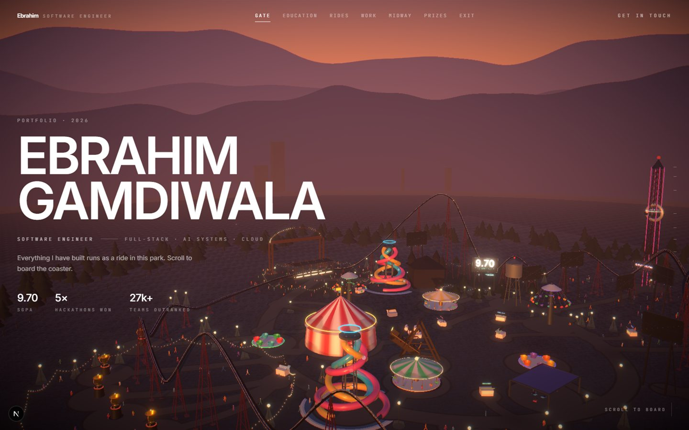
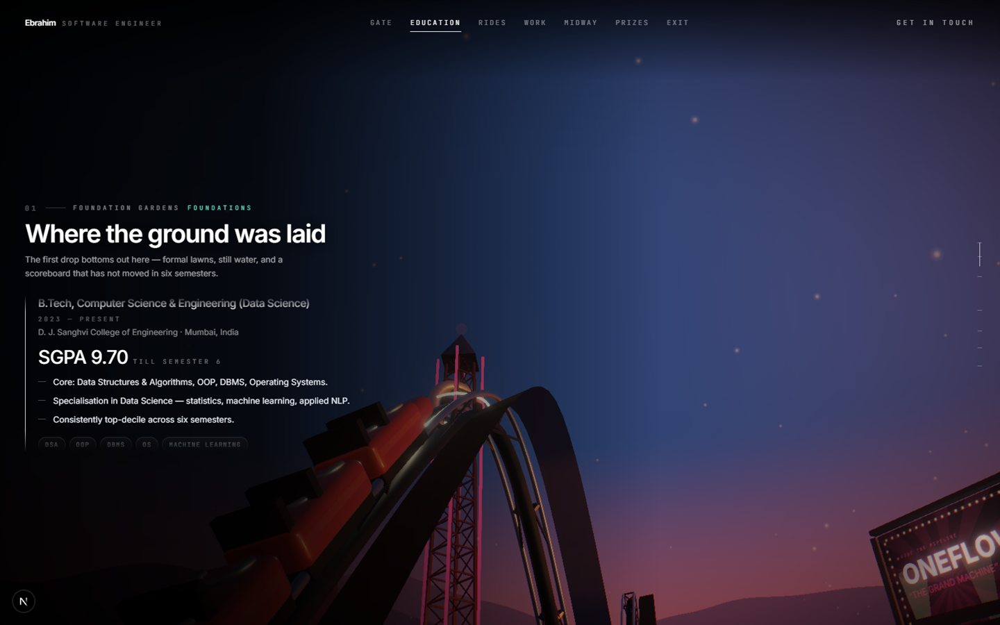
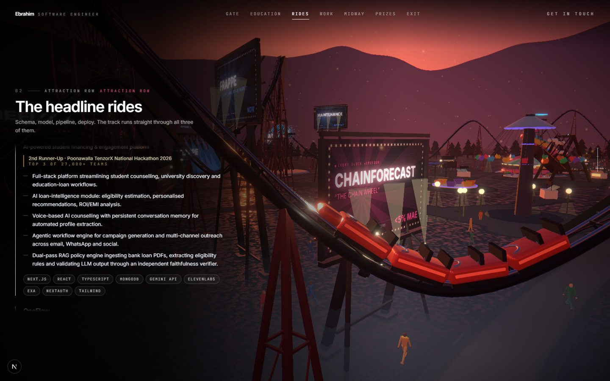
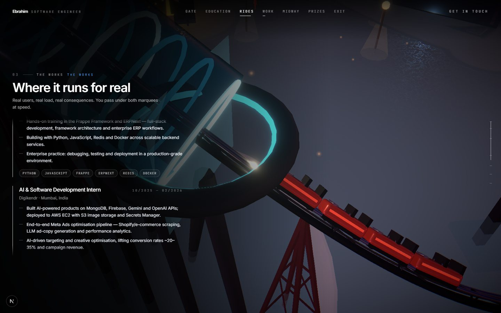
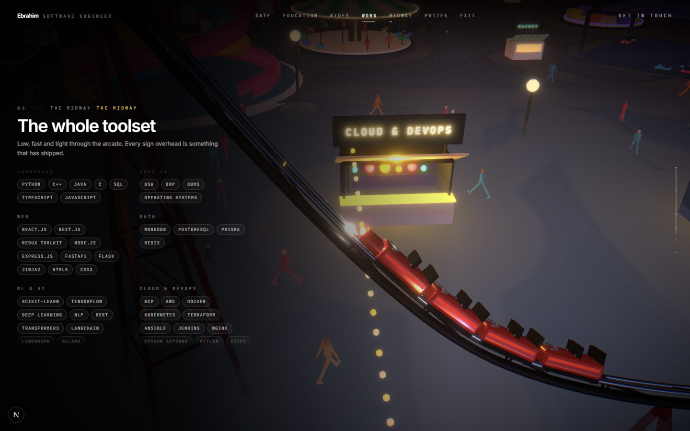
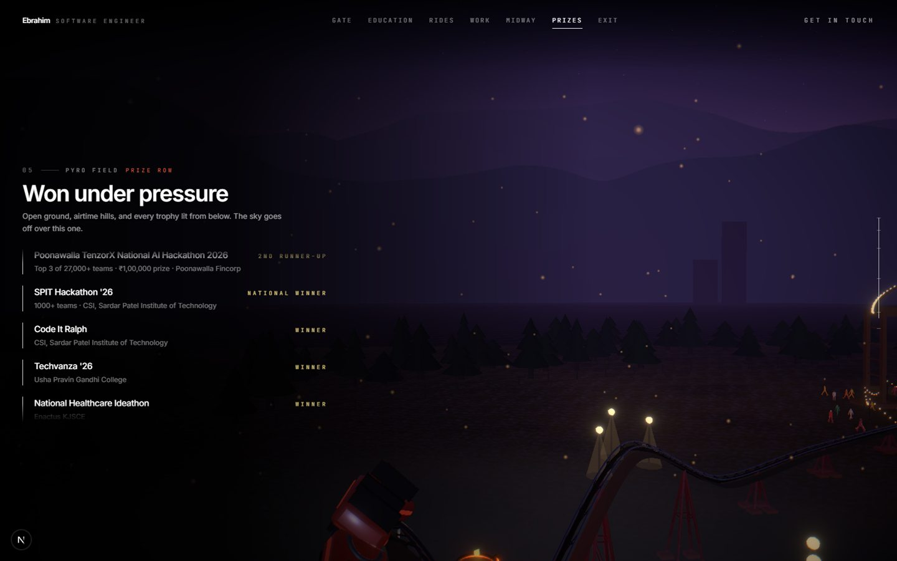
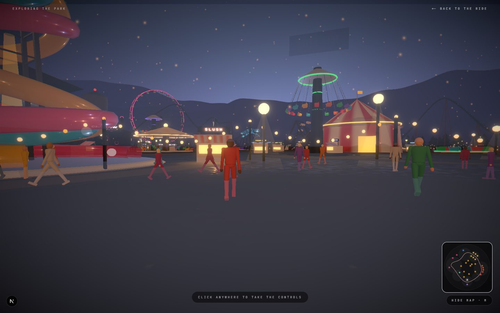
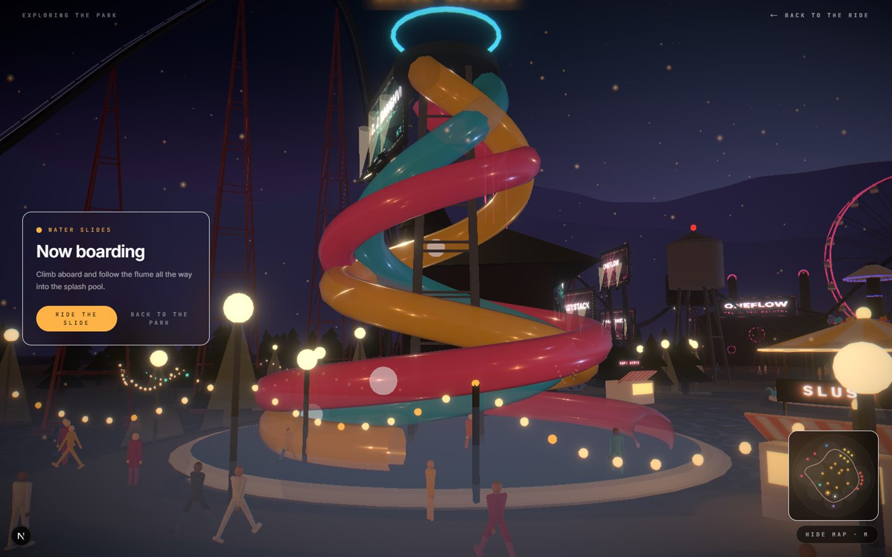
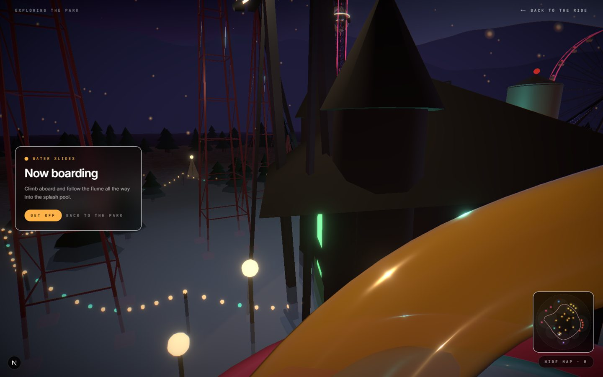
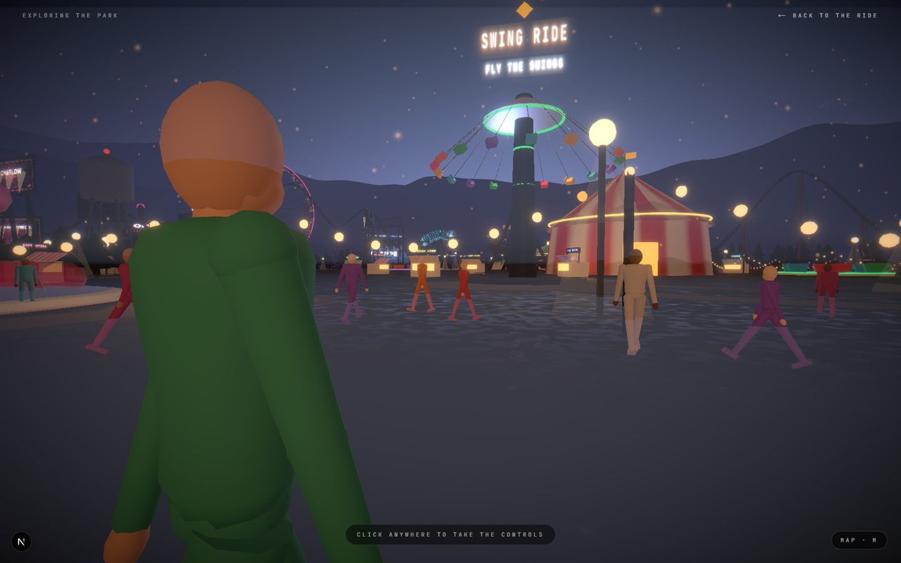

# Ebrahim Gamdiwala — Portfolio

A résumé built as a scroll-driven roller-coaster ride through a photoreal amusement park at
dusk. Projects are the headline attractions, jobs are the marquee venues, skills are the midway
stalls, awards are the prize row, and roadside **ad hoardings** carry each one as a poster you
read on the approach — the way you'd read billboards from a moving car. The sun sets as you
descend into the park, and because the circuit is closed, the lap wraps back to the station and
the day starts over.

Finish a lap and the park opens up: scroll-driven playback hands off to a first-person
**explore mode** where you can walk the midway, ride the drop tower, the big wheel, or drive the
bumper cars yourself.

There are no photo textures, HDRIs, or imported 3D models anywhere in the project. Every
surface — ground, signage, posters, sky — is generated and painted at runtime from a single
seed.

**Next.js 15 · React 19 · TypeScript · three.js / @react-three/fiber · drei · postprocessing · Tailwind CSS · Lenis**

<p align="center">
  
</p>

```bash
npm install
npm run dev      # http://localhost:3000
```

## The ride

Six stations, one closed circuit. Each one owns a slice of the scroll and a zone of the park —
scroll past the gate and the coaster banks through education, the headline rides, the works,
the midway, and the prize row before the brake run carries you back to the station.

<table>
  <tr>
    <td width="50%"><br /><sub><b>01 · Foundation Gardens</b> — the first drop, a still-water scoreboard that hasn't moved in six semesters</sub></td>
    <td width="50%"><br /><sub><b>02 · Attraction Row</b> — the headline projects, each one a structure with its own billboard</sub></td>
  </tr>
  <tr>
    <td width="50%"><br /><sub><b>03 · The Works</b> — where the code runs for real, production not prototypes</sub></td>
    <td width="50%"><br /><sub><b>04 · The Midway</b> — every stall overhead is something that has shipped</sub></td>
  </tr>
</table>

<p align="center">
  <br />
  <sub><b>05 · Pyro Field</b> — hackathon wins, trophies lit from below, the sky about to go off</sub>
</p>

## Content lives in one file

Everything you'd normally want to change — copy, contact info, the ride itself — lives in
[`src/data/park.json`](src/data/park.json):

- `meta` — name, role, contact, socials, résumé path
- `park` — park name, RNG seed, splash-flume placement, and the dusk → night sky keyframes
- `theme` — accent / text / muted colors
- `hero` — landing copy and headline stats
- `stations[]` — the ride itself, in order

Each station owns a slice of the scroll timeline and a zone of the park:

```jsonc
{
  "id": "projects",
  "kind": "projects",          // picks the overlay renderer in StationContent.tsx
  "zone": "attractionRow",     // a zone in src/lib/park/layout.ts
  "accent": "#ff4d8d",         // drives every neon and hoarding in this zone
  "shots": ["flank", "drone", "chase", "flank", "onboard", "drone"],
  "scroll": { "enter": 0.24, "exit": 0.48 },   // 0 = top of page, 1 = bottom
  "items": [{
    "title": "StudyStack",
    "points": ["…"], "tags": ["…"],
    "attraction": "dropTower",   // which structure gets built for it
    "poster": {                  // ← painted onto a real billboard in the park
      "kicker": "NOW BOARDING",
      "headline": "STUDYSTACK",
      "ride": "THE LOAN DROP",
      "sub": "TOP 3 OF 27,000 TEAMS",
      "stat": "₹1,00,000"
    }
  }]
}
```

`scroll` ranges must be contiguous and cover 0 → 1. Everything else is optional — leave out a
`poster` and one is derived from the item's own title and subtitle.

**`attraction`** picks the structure built for an item: `dropTower`, `ferrisWheel`,
`machineHall`, `mainStage`, `scoreboard`, `stall`, `plinth`. Omit both `attraction` and `poster`
and the item lives in the copy overlay only, with nothing built for it in the world. Positions
come from `SLOTS` in `src/lib/park/layout.ts`, consumed in JSON order.

**`shots`** is the camera cut list for a station, spread evenly across its slice:

| rig | shot |
| --- | --- |
| `onboard` | front seat, banking with the track |
| `chase` | behind and above the train |
| `flank` | alongside, train in profile against the park |
| `drone` | high and ahead, looking back as the train comes on |
| `crane` | a fixed camera by the rails that the train sweeps past |

## Explore mode

Finish a lap and an invitation appears; taking it swaps the scroll-driven ride for first-person
controls — click once to capture the mouse, then WASD to walk, mouse to look, shift to run, M
for the map, escape to let go. On mobile this becomes an on-screen joystick. You cannot walk
through the rides or past the fence (`src/lib/explore/collide.ts`).

Markers stand over every attraction, generated from the same `park.json` (`src/lib/explore/markers.ts`).
Aim the crosshair at one and click: the camera flies to it and a card opens with that item's
real detail. The minimap in the corner is drawn from the layout tables and the solved circuit,
and clicking a ride on it selects that marker too.

<table>
  <tr>
    <td width="50%"><br /><sub>on foot at the gate, midway stretching ahead, minimap bottom right</sub></td>
    <td width="50%"><br /><sub>walk up to a marker, the real detail opens</sub></td>
  </tr>
  <tr>
    <td width="50%"><br /><sub>strapped in and riding, camera in the seat</sub></td>
    <td width="50%"><br /><sub>press M for the map, solved from the same layout tables</sub></td>
  </tr>
</table>

Several rides are **boardable**:

- **Drop tower** and **big wheel** — the camera straps into the actual moving car; boarding the
  tower restarts its cycle from the bottom so you never queue.
- **Bumper cars** — fully drivable. Board one and steer it yourself with WASD (or the on-screen
  joystick on mobile) while the camera tracks the car, with real dodgem physics: acceleration,
  drift, and bounce off the rink wall and the other cars, rather than a scripted path.
- **Machine hall** — throwing the switch winds its gears up.
- **Main stage** — brings its lighting rig to life.
- **Pirate galleon** — swings on its mast, seat and camera synced to the swing.
- **Gate** — the guest book, and the way to reach me.

Marker copy, framing, and which rides are boardable live in `src/lib/explore/markers.ts`; the
mode itself is a small external store in `src/lib/explore/store.ts` — external rather than React
context because the overlay and the markers sit in two different reconcilers.

## How it works

```
src/
├─ app/                    Next.js App Router shell (layout, page, globals.css)
├─ components/
│  ├─ Experience.tsx       Top-level orchestrator: ScrollProvider + mode switch
│  ├─ park/                three.js / R3F scene: canvas, world, rides, camera rigs, effects
│  └─ ui/                  DOM overlay: navbar, hero, station copy, explore HUD, loader
├─ data/park.json          The single content source described above
└─ lib/
   ├─ content.ts, usePark.ts   Typed accessors + memoized world builder
   ├─ park/                World generation — layout, coaster physics, materials, signage…
   ├─ explore/             First-person mode — collision, markers, touch input, mode store
   └─ scroll/              Lenis-backed scroll timeline, read via refs (not React state)
```

| What | Where |
| --- | --- |
| Zones, ride slots, funfair placement | `src/lib/park/layout.ts` |
| Coaster spline, speed and banking | `src/lib/park/coaster.ts` |
| Hoarding placement off the rails | `src/lib/park/signage.ts` |
| Poster artwork | `src/lib/park/poster.ts` |
| Splash run placement | `park.splash` in `src/data/park.json` |
| Explore markers and activities | `src/lib/explore/markers.ts` |
| Walkable collision footprints | `src/lib/explore/collide.ts` |
| Crowd geometry | `src/lib/park/human.ts` |
| Ground surface map (paths, pads, wear) | `src/lib/park/parkMap.ts` |
| Procedural materials | `src/lib/park/textures.ts` |
| Dusk → night keyframes | `src/lib/park/sky.ts` |
| Practical light candidates | `src/lib/park/lights.ts` |
| Scroll timing and lap wrap | `src/lib/scroll/timeline.ts` |

Two things are worth knowing before changing the ride:

**Speed is physical.** Rather than moving the car at a constant rate along the spline, the
builder solves `v = sqrt(2g·Δh)` from the crest of the lift hill and integrates `dt = ds/v` into
a time table. The car crawls up the lift and howls out of the drop because the geometry says it
should. The brake run bleeds it back to chain speed before the station, which is also what makes
the lap wrap invisible.

**Banking is physical.** Each sample's roll is `atan(v²κ/g)` — the angle that puts the rider's
net force straight down through the seat. That is how real track is designed.

## Notes

- The park is generated once behind the loader from one seed and cached at module scope.
- Nothing scroll-linked goes through React state. `ScrollProvider` exposes refs that both the
  canvas and the DOM overlay read inside their own animation frames.
- There are no photo textures, HDRIs or model files anywhere in this project. Every surface is
  baked from a canvas at runtime; realism comes from material response, the prefiltered
  environment map in `env.ts`, and bloom.
- ~80 things in the park want to cast light. `LightPool` keeps a handful of real point lights
  and reassigns them to whichever candidates are nearest the camera each frame.
- Quality tiers step down automatically when frames slip (`src/components/park/Quality.tsx`).
  Append `?q=low|medium|high` to pin one (and freeze the auto-downgrade) — useful for checking
  how it holds up a notch down.
- In development, `window.__ride.seek(0..1)` parks the ride at an exact point and `window.__park`
  exposes the solved circuit and layout tables.
